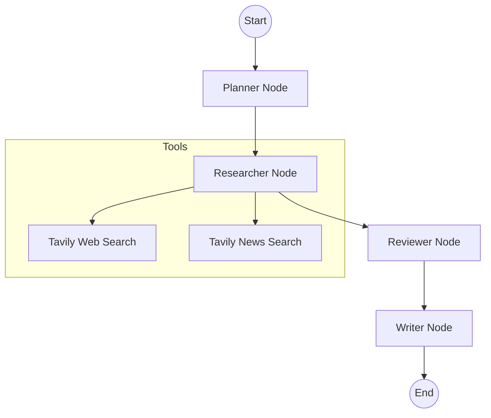

# Discord Research Assistant (v1.1)

Discord Research Assistant is a powerful Discord bot built with **LangGraph** and **LangChain**. It automates the process of researching complex topics by orchestrating a multi-agent workflow to gather, review, and summarize information from web and news sources.

## 🚀 Features

- **Slash Command:** Start research tasks directly from Discord using `/research [topic]`.
- **Multi-Agent Workflow:** Utilizes a stateful orchestration of specialized AI agents:
  - **Planner:** Analyzes the query and generates research objectives.
  - **Researcher:** Gathers data using advanced web and news search tools.
  - **Reviewer:** Filters findings for relevance and completeness.
  - **Writer:** Synthesizes findings into a concise, Discord-optimized TL;DR summary.
- **Stateful Design:** Managed workflow state using LangGraph for transparent and observable transitions.
- **Tavily Integration:** Specialized tools for high-quality web and news search results.

## 🏗️ Architecture

The system is designed around a shared workflow state (`AgentState`) managed by a LangGraph `StateGraph`.



## 🛠️ Tech Stack

- **Language:** Python 3.10+
- **Library:** `discord.py`
- **AI Framework:** `LangGraph`, `LangChain`
- **LLM:** OpenAI (GPT-4o)
- **Search API:** Tavily

## 📋 Prerequisites

- Python 3.10 or higher
- A Discord Bot Token (from [Discord Developer Portal](https://discord.com/developers/applications))
- An OpenAI API Key
- A Tavily API Key

## ⚙️ Installation

1. **Clone the repository:**
   ```bash
   git clone <repository-url>
   cd <project-folder>
   ```

2. **Install dependencies:**
   ```bash
   pip install -r requirements.txt
   ```

3. **Configure environment variables:**
   Copy the `.env.example` to `.env` and fill in your keys:
   ```bash
   cp .env.example .env
   ```
   Edit `.env`:
   ```env
   DISCORD_TOKEN=your_discord_bot_token
   OPENAI_API_KEY=your_openai_api_key
   TAVILY_API_KEY=your_tavily_api_key
   ```

## 🚀 Running the Bot

1. **Start the bot:**
   ```bash
   python src/main.py
   ```

2. **Sync Slash Commands:**
   In Discord, as the bot owner, run the prefix command `!sync` to register the `/research` command (this may take a few moments to propagate globally).

3. **Use the Command:**
   Type `/research topic: [your topic]` in any channel the bot has access to.

## 📁 Project Structure

```text
├── src/
│   ├── main.py            # Entry point & Bot setup
│   ├── bot/
│   │   └── commands.py    # Discord command handlers
│   ├── agents/
│   │   ├── state.py       # LangGraph state definition
│   │   ├── graph.py       # Workflow orchestration
│   │   └── nodes.py       # Agent node logic
│   └── tools/
│       └── search.py      # Tavily search integrations
├── tasks/                 # Development task tracking
├── docs/                  # PRD and research notes
├── requirements.txt
└── .env.example
```

## 📝 License

Distributed under the MIT License. See `LICENSE` for more information.
