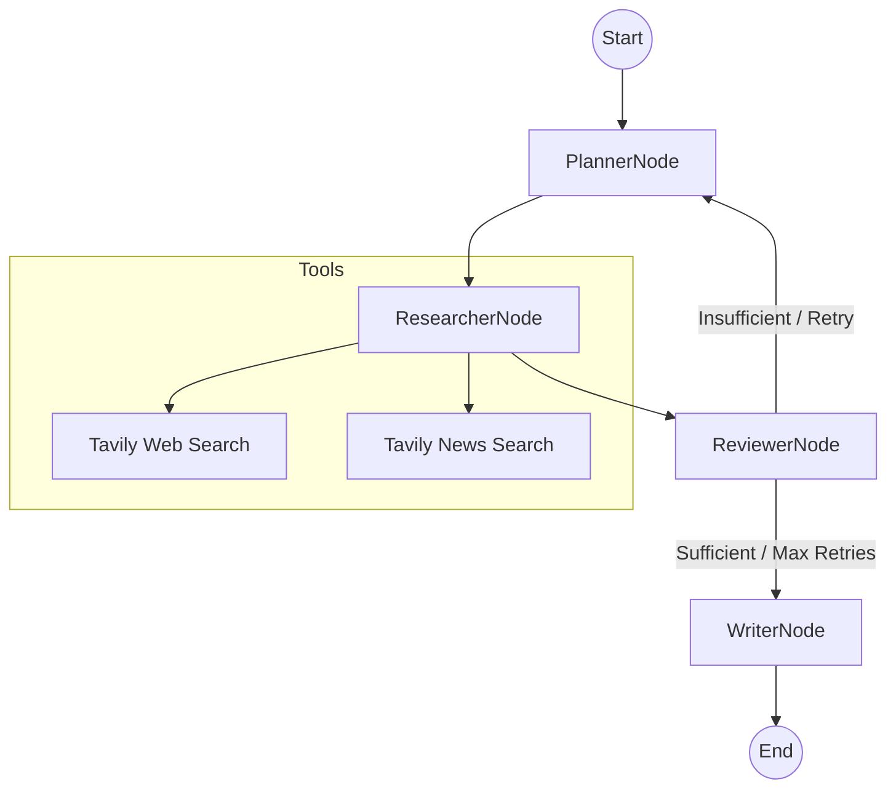

# Discord Research Assistant (v2.1)

Discord Research Assistant is a powerful Discord bot built with **LangGraph** and **LangChain**. It automates the process of researching complex topics by orchestrating a multi-agent workflow to gather, review, and summarize information from web and news sources.

## 🚀 Features

- **Slash Command:** Start research tasks directly from Discord using `/research [topic]`.
- **Real-time Progress Streaming:** Watch the assistant work in real-time with live status updates and iteration tracking directly in Discord.
- **Iterative Research Loop:** Advanced logic that allows the system to identify information gaps and re-plan research up to 3 times to ensure high-quality findings.
- **Skeptical Senior Reviewer:** A specialized agent persona that performs rigorous gap analysis and source quality ranking (Official > News > Academic > Blogs).
- **Multi-Agent Workflow:** Utilizes a stateful orchestration of specialized AI agents:
  - **Planner:** Generates and refines research strategies based on feedback.
  - **Researcher:** Gathers data using advanced web and news search tools.
  - **Reviewer:** Performs deep quality assessment and source ranking.
  - **Writer:** Synthesizes findings into a concise, Discord-optimized report with confidence summaries.
- **Optimized Interaction:** Fixed "Unknown Interaction" errors using asynchronous event streaming and immediate response deferral.

## 🏗️ Architecture

The system is designed around a shared workflow state (`AgentState`) managed by a LangGraph `StateGraph`. The workflow now includes a conditional retry loop for higher research quality.



## 🛠️ Tech Stack

- **Language:** Python 3.10+
- **Library:** `discord.py`
- **AI Framework:** `LangGraph`, `LangChain`
- **LLM:** Ollama (Default: `gemma4:31b-cloud`) via `ChatOllama`
- **Search API:** Tavily

## 📋 Prerequisites

- Python 3.10 or higher
- A Discord Bot Token (from [Discord Developer Portal](https://discord.com/developers/applications))
- [Ollama](https://ollama.com/) installed and running locally or on a server.
- A Tavily API Key

## ⚙️ Installation

1. **Clone the repository:**
   ```bash
   git clone <repository-url>
   cd <project-folder>
   ```

2. **Install dependencies:**
   ```bash
   pip install -r requirements.txt
   ```

3. **Configure environment variables:**
   Copy the `.env.example` to `.env` and fill in your keys:
   ```bash
   cp .env.example .env
   ```
   Edit `.env`:
   ```env
   DISCORD_TOKEN=your_discord_bot_token
   TAVILY_API_KEY=your_tavily_api_key
   ```

## 🚀 Running the Bot

1. **Start the bot:**
   ```bash
   python src/main.py
   ```

2. **Sync Slash Commands:**
   In Discord, as the bot owner, run the prefix command `!sync` to register the `/research` command (this may take a few moments to propagate globally).

3. **Use the Command:**
   Type `/research topic: [your topic]` in any channel the bot has access to.

## 📁 Project Structure

```text
├── src/
│   ├── main.py                # Entry point & Bot setup
│   ├── bot/
│   │   ├── commands.py        # Discord command handlers
│   │   └── utils.py           # Progress management & Formatting
│   ├── agents/
│   │   ├── state.py           # LangGraph state definition
│   │   ├── graph.py           # Workflow orchestration & Dependency Injection
│   │   └── nodes/             # Modular agent node logic
│   │       ├── __init__.py    # Node exports
│   │       ├── planner.py     # PlannerNode class
│   │       ├── researcher.py  # ResearcherNode class
│   │       ├── reviewer.py    # ReviewerNode class
│   │       ├── writer.py      # WriterNode class
│   │       ├── schemas.py     # Pydantic models & Parsers
│   │       └── utils.py       # Shared helper functions
│   └── tools/
│       └── search.py          # Tavily search integrations
├── tasks/                     # Development task tracking
├── docs/                      # PRD and research notes
├── requirements.txt
└── .env.example
```

## 📝 License

Distributed under the MIT License. See `LICENSE` for more information.
